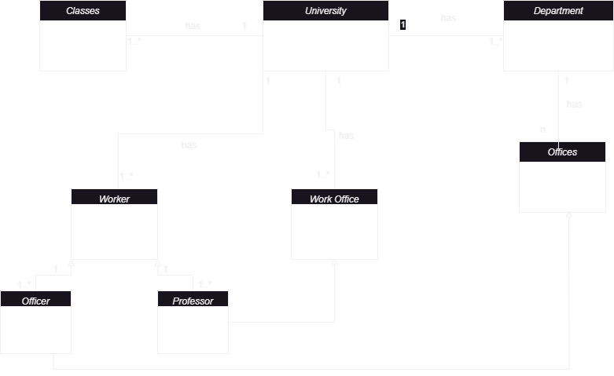

Selam;
Patika üzerinden devam ettiğim Class Diagram dersine ait çok basit bir örnek görebiliriz.
Herkese iyi çalışmalar.
-Örnek detayları-
1 - Üniversiteye ait sınıflıklar, çalışma ofisleri ve departmanlar vardır.
2 - Departmanlara ait ofisler vardır.
3 - Üniversiteye ait çalışanlar vardır. Bu çalışanlar profesör veya memur olabilir.
4 - Her çalışan bir ofiste çalışır.
***
Hi there;
We can see a very simple example of the Class Diagram lesson that I continue on the path.
Good work to everyone.
-Example details-
1 - There are classrooms, work offices and departments belonging to the university.
2 - There are offices belonging to departments.
3 - There are employees belonging to the university. These employees can be professors or civil servants.
4 - Each employee works in an office.
***

